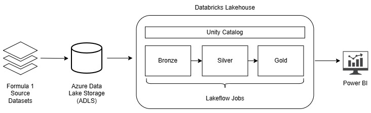
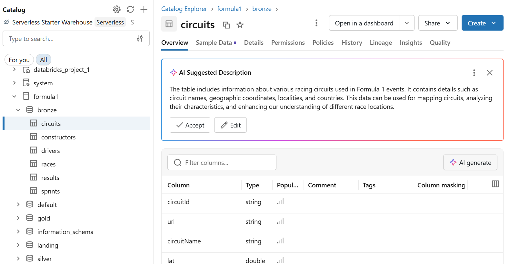
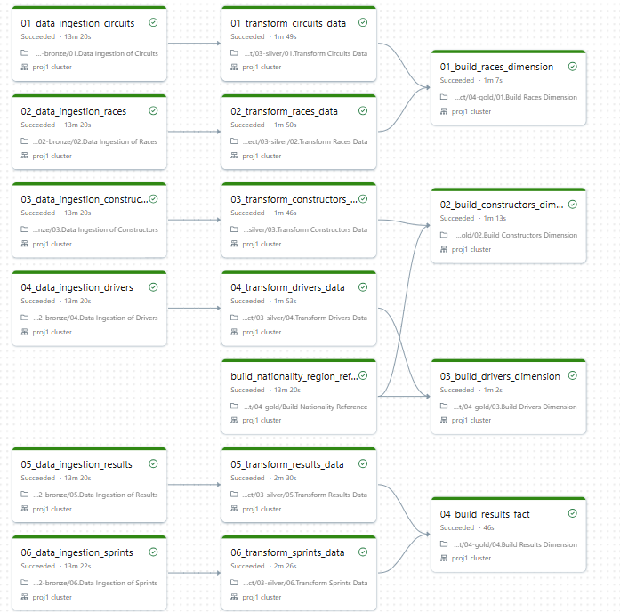

# Formula 1 Analytics Platform on Azure Databricks

## Project Overview

This project implements an end-to-end modern data platform for Formula 1 analytics using Azure Databricks and Power BI.

Raw Formula 1 datasets are ingested into Azure Data Lake Storage and transformed through a Medallion Architecture (Bronze, Silver and Gold) using PySpark and Delta Lake. The data in the Gold layer is then imported to Power BI to analyse driver performance, constructor standings and historical racing trends.

The project demonstrates **key concepts** including:
- Medallion Architecture
- Data Lakehouse design
- Delta Lake transactions and time travel
- Data quality enforcement
- Metadata-driven ingestion
- Workflow orchestration with Lakeflow Jobs
- Data governance with Unity Catalog
- Dimensional modelling for analytics
- Power BI reporting

## Architecture

## Technology Stack
| Component | Technology |
| Cloud Storage | Azure Data Lake Storage | 
| Processing Engine | Apache Spark on Azure Databricks |
| Data Format | Delta Lake | 
| Data Governance | Unity Catalog | 
| Data Transformation | PySpark | 
| Workflow Orchestration | Lakeflow Jobs | 
| Analytics | Power BI | 

## Data Source
The project uses publicly available [Formula 1 datasets](https://github.com/jolpica/jolpica-f1). 

Datasets include:
- Drivers
- Constructors
- Circuits
- Races
- Results
- Sprints

## Data Pipeline 
The project follows the Medallion Architecture pattern to progressively improve data quality and prepare datasets for analytics. 

### Landing Layer
Raw Formula 1 source files are stored in Azure Data Lake Storage and serve as the controlled entry point into the platform.

### Bronze Layer
Raw datasets are ingested into Delta tables with schema enforcement and metadata tracking, preserving the original source data for auditability and reprocessing.

### Silver Layer
Data is cleansed, standardised and validated. This layer applies data quality checks, removes duplicates and prepares datasets for downstream analytics.

### Gold Layer 
Business-ready datasets are modelled using fact and dimension tables to support efficient analytical queries and Power BI reporting.

## Engineering Features
### Delta Lake 
Delta Lake was used as the storage format for all datasets. Delta lake formats ensures ACID transactions and version version history through transaction logs. 

### Unity Catalog
Unity Catalog was used to centrally govern and manage data assets across the platform, such as managing permissions for users. 
External Locations and Storage Credentials were configured to provide secure access between Azure Databricks and Azure Data Lake Storage.

### Lakeflow Jobs
Lakeflow Jobs was used to orchestrate the end-to-end data pipeline across the Bronze, Silver and Gold layers. The workflow manages task dependencies, coordinates notebook execution and provides monitoring for pipeline runs.

