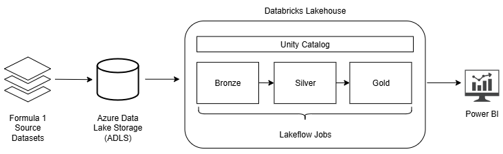

# Formula 1 Analytics Platform on Azure Databricks

End-to-end data engineering and analytics project built using Azure Databricks, Delta Lake, Azure Data Lake Storage and Power BI.

## Project Overview

This project implements an end-to-end modern data platform for Formula 1 analytics using Azure Databricks and Power BI.

Raw Formula 1 datasets are ingested into Azure Data Lake Storage and transformed through a Medallion Architecture (Bronze, Silver, Gold) using PySpark and Delta Lake. The data in the Gold layer is then imported to Power BI to analyse driver performance, constructor standings and historical racing trends.

The project demonstrates key concepts including:
- Medallion Architecture
- Data Lakehouse design
- Delta Lake transactions and time travel
- Data quality enforcement
- Metadata-driven ingestion
- Workflow orchestration with Lakeflow Jobs
- Data governance with Unity Catalog
- Dimensional modelling for analytics
- Power BI reporting

## Architecture

